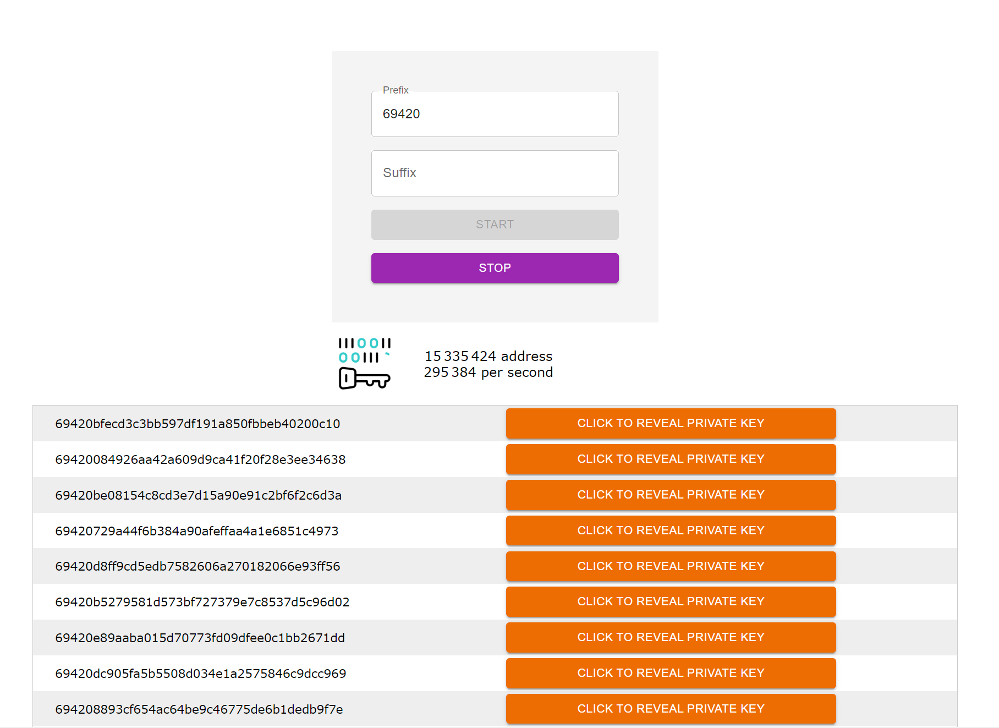

# VANITY-ETH

## GPU accelerated Ethereum vanity address generator using WebGPU compute shader

### [Demo here](https://vanity-eth.modez.pro/)



Choose a brief prefix and/or suffix, then click start. Your browser will generate multiple random addresses until one matches your criteria.

Vanity address generator has been there for a long time, this version unlocks up to 20 time the speed of the CPU version like vanity-eth.tk by using WebGPU


## Benchmark

| Hardware              | WebGPU |  vanity-eth.tk - CPU |
| :---------------- | :------: | ----: |
| Mac M1        |   135 000 / s   | 16 000 / s |
| Mac M1 Pro Max        |   290 000 / s   | 17 000 / s |
| Intel i9-12900K - RTX 3070         |   310 000 / s   | 30 000 / s |


If you have a M1 or dedicated GPU you can change those value in gpu.ts to
```javascript
const NB_ITER = 1024;
const NB_THREAD = 256;
```

Then you can reach 400 000 / s, but the tradeoff is that it may crash on hardwares with integrated chipset GPU.
